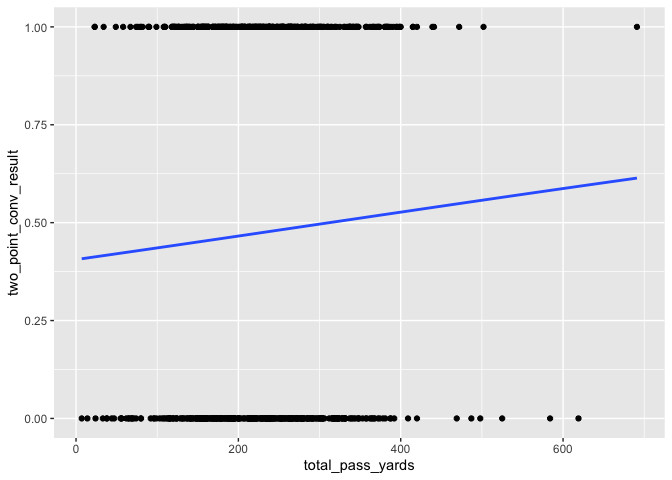

Modeling
========

We tried a couple statistical methods to predict whether a two-point
conversion would be successful or not. We shared our work and results
here.    

Model 1: Logistic Regression
----------------------------

We created a logistic regression model to determine what variables were
significant in predicting the success probability of a two-point
conversion. Because we are testing our thesis that a run play is a more
successful option than a pass play, we included numerous variables that
quantify the team’s success with running the ball in the game up until
the two-point conversion attempt.  

    glm_twopt <- glm(two_point_conv_result ~ prop_runs_greater_than_2_yards + prop_passes_greater_than_2_yards + total_pass_yards + total_run_yards + num_runs + num_passes + avg_yds_per_play + completion_percentage + play_type + score_differential + avg_yards_per_run + avg_yards_per_pass, family = binomial(link= "logit"), data=two_points, na.action = na.exclude)

    summary(glm_twopt)

    ## 
    ## Call:
    ## glm(formula = two_point_conv_result ~ prop_runs_greater_than_2_yards + 
    ##     prop_passes_greater_than_2_yards + total_pass_yards + total_run_yards + 
    ##     num_runs + num_passes + avg_yds_per_play + completion_percentage + 
    ##     play_type + score_differential + avg_yards_per_run + avg_yards_per_pass, 
    ##     family = binomial(link = "logit"), data = two_points, na.action = na.exclude)
    ## 
    ## Deviance Residuals: 
    ##     Min       1Q   Median       3Q      Max  
    ## -1.9193  -1.1011  -0.8825   1.1939   1.6745  
    ## 
    ## Coefficients:
    ##                                   Estimate Std. Error z value Pr(>|z|)   
    ## (Intercept)                       0.940460   1.306441   0.720  0.47161   
    ## prop_runs_greater_than_2_yards    0.497273   0.733317   0.678  0.49770   
    ## prop_passes_greater_than_2_yards  0.549797   1.430611   0.384  0.70075   
    ## total_pass_yards                  0.007786   0.004103   1.897  0.05776 . 
    ## total_run_yards                   0.008572   0.005676   1.510  0.13103   
    ## num_runs                         -0.033314   0.031230  -1.067  0.28610   
    ## num_passes                       -0.051755   0.027959  -1.851  0.06415 . 
    ## avg_yds_per_play                 -0.006595   0.265428  -0.025  0.98018   
    ## completion_percentage            -1.028656   1.379796  -0.746  0.45596   
    ## play_typerun                      0.505161   0.190867   2.647  0.00813 **
    ## score_differential               -0.005140   0.008596  -0.598  0.54988   
    ## avg_yards_per_run                -0.105996   0.119651  -0.886  0.37568   
    ## avg_yards_per_pass               -0.096178   0.171378  -0.561  0.57466   
    ## ---
    ## Signif. codes:  0 '***' 0.001 '**' 0.01 '*' 0.05 '.' 0.1 ' ' 1
    ## 
    ## (Dispersion parameter for binomial family taken to be 1)
    ## 
    ##     Null deviance: 936.50  on 676  degrees of freedom
    ## Residual deviance: 910.45  on 664  degrees of freedom
    ##   (1 observation deleted due to missingness)
    ## AIC: 936.45
    ## 
    ## Number of Fisher Scoring iterations: 4

 

### Model 1: Data Vis

Uses a binomial modeling technique to graph relationship between
probability of successful two-point conversion and changing x axis

    #Increasing probability of two point conversion success based on number of total passing yards
    pass_yards_convprob <- ggplot(two_points, aes(x = total_pass_yards, y = two_point_conv_result)) + 
      geom_point() + 
      stat_smooth(method = "glm", method.args = list(family="binomial"), se = FALSE)

    pass_yards_convprob

    ## `geom_smooth()` using formula 'y ~ x'

    ## Warning: Removed 1 rows containing non-finite values (stat_smooth).

    ## Warning: Removed 1 rows containing missing values (geom_point).

