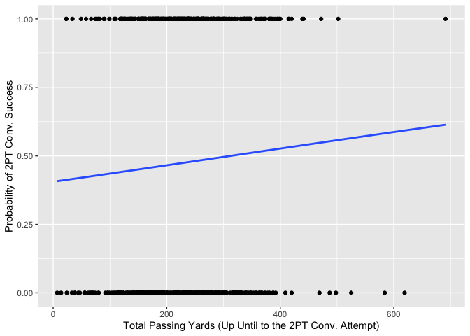
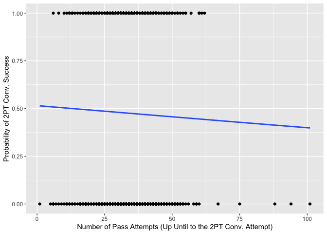
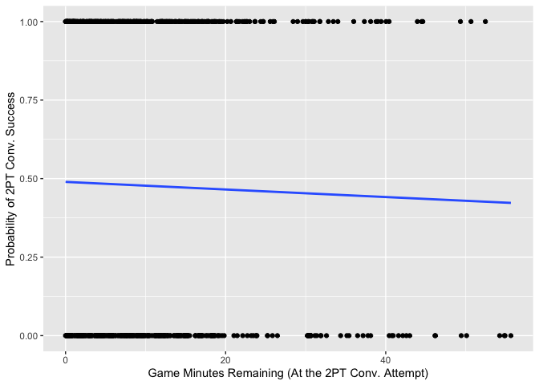

Methods and Results
===================

We tried a couple statistical methods to predict whether a two-point
conversion would be successful or not. We shared our work and results
here.    

Model 1: Logistic Regression
----------------------------

We created a logistic regression model to determine what variables were
significant in predicting the success probability of a two-point
conversion. Because we are testing our thesis that a run play is a more
successful option than a pass play, we included numerous variables that
quantify the team’s success with running the ball in the game up until
the two-point conversion attempt.  

    glm_twopt <- glm(two_point_conv_result ~ prop_runs_greater_than_2_yards + prop_passes_greater_than_2_yards + total_pass_yards + total_run_yards + num_runs + num_passes + avg_yds_per_play + completion_percentage + play_type + score_differential + avg_yards_per_run + avg_yards_per_pass + score_differential + game_seconds_remaining + third_down_conv_percentage, family = binomial(link= "logit"), data = two_points, na.action = na.exclude)

  We then used the stepAIC function to select the best predictors to
use in our logistic regression model. This is the model that the stepAIC
function selected.

    summary(aic_glm)

    ## 
    ## Call:
    ## glm(formula = two_point_conv_result ~ total_pass_yards + num_passes + 
    ##     play_type + game_seconds_remaining, family = binomial(link = "logit"), 
    ##     data = two_points, na.action = na.exclude)
    ## 
    ## Deviance Residuals: 
    ##     Min       1Q   Median       3Q      Max  
    ## -1.6423  -1.0974  -0.8989   1.2077   1.5291  
    ## 
    ## Coefficients:
    ##                          Estimate Std. Error z value Pr(>|z|)   
    ## (Intercept)             0.2607147  0.4228716   0.617  0.53754   
    ## total_pass_yards        0.0043591  0.0014478   3.011  0.00260 **
    ## num_passes             -0.0390003  0.0134621  -2.897  0.00377 **
    ## play_typerun            0.5290071  0.1831721   2.888  0.00388 **
    ## game_seconds_remaining -0.0002490  0.0001637  -1.521  0.12828   
    ## ---
    ## Signif. codes:  0 '***' 0.001 '**' 0.01 '*' 0.05 '.' 0.1 ' ' 1
    ## 
    ## (Dispersion parameter for binomial family taken to be 1)
    ## 
    ##     Null deviance: 932.65  on 673  degrees of freedom
    ## Residual deviance: 910.22  on 669  degrees of freedom
    ##   (1 observation deleted due to missingness)
    ## AIC: 920.22
    ## 
    ## Number of Fisher Scoring iterations: 4

 

### Model 1: Data Vis

We use a binomial modeling technique to graph relationship between
probability of successful two-point conversion and the predictors.  
  **The probability of two point conversion success increases as the
number of total passing yards increases.**

    ggplot(two_points, aes(x = total_pass_yards, y = two_point_conv_result)) + 
      geom_point() + 
      stat_smooth(method = "glm", method.args = list(family="binomial"), se = FALSE) +
      labs(x = "Total Passing Yards (Up Until to the 2PT Conv. Attempt)", y = "Probability of 2PT Conv. Success")

    ## `geom_smooth()` using formula 'y ~ x'

    ## Warning: Removed 1 rows containing non-finite values (stat_smooth).

    ## Warning: Removed 1 rows containing missing values (geom_point).

        **The probability of two point conversion success
descreases as the number of passes thrown by the possession team
increases.**

    ggplot(two_points, aes(x = num_passes, y = two_point_conv_result)) + 
      geom_point() + 
      stat_smooth(method = "glm", method.args = list(family="binomial"), se = FALSE) +
      labs(x = "Number of Pass Attempts (Up Until to the 2PT Conv. Attempt)", y = "Probability of 2PT Conv. Success")

    ## `geom_smooth()` using formula 'y ~ x'

        **The probability of two point conversion success
descreases when there is more time remaining in the game.**

    ggplot(two_points, aes(x = game_seconds_remaining/60, y = two_point_conv_result)) + 
      geom_point() + 
      stat_smooth(method = "glm", method.args = list(family="binomial"), se = FALSE) +
      labs(x = "Game Minutes Remaining (At the 2PT Conv. Attempt)", y = "Probability of 2PT Conv. Success")

    ## `geom_smooth()` using formula 'y ~ x'

